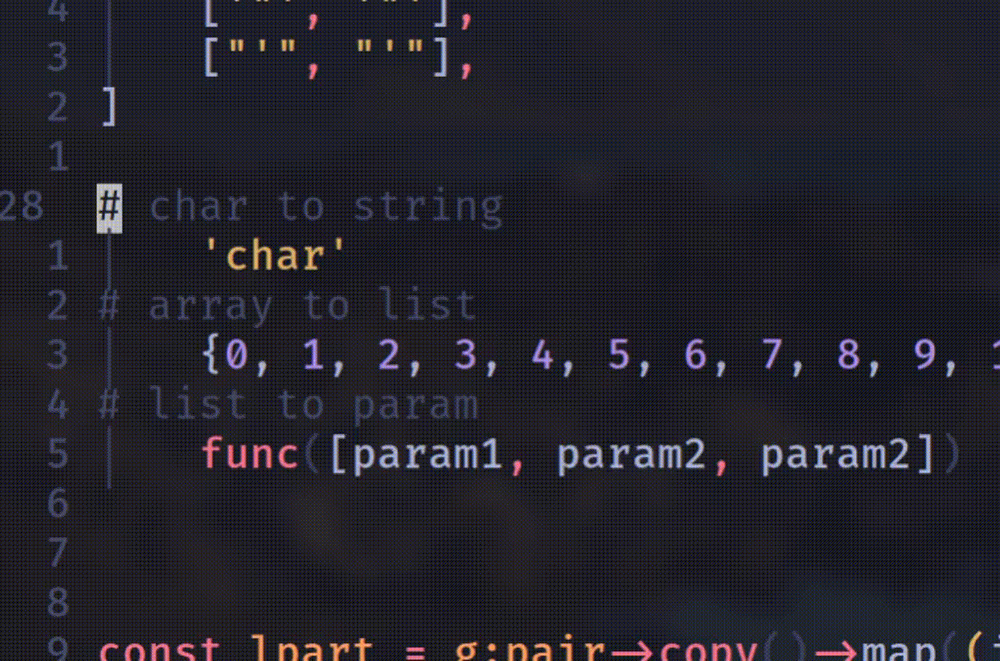

# Gmotion.vim
provide a general motion for block text-objects with highlight!

## Usage
After initial load, gmotion will automatically parse the current buffer, if it finds any block text-object (like ""、[]、''、()、<>, {}...) in current line, it will highlight the prefix and the suffix part of the text-object.
By default, only `""`, `[]`, `''`, `()`, `<>`, `{{}` surrounded text-object are defined, you candefine your own text-object, see[跳转到小节](#custome) for more details and limitations.

### `g` As General Motion
If you familiar with vim's text-objects, than you must be used to those `ci(`、`di{`、`ci"`、`ya[` quick motions, however, sometimes you may find it takes a bit time to determine to press which key, not to mension `({<"` are ***far from***fingers.
This is where gmotion help you out, instead of typing `i(`、`i{`、`a[`、`a<`, typing `ig` and `ag` will work the same. With highlighted prefix and surffix, you can easily tell which text-object is on operation.

ig and ag example:


### `gh` And `gl` As Move and Motion
By typing `gh` or `gl`, you can move quickily to the left or right part of the text-object


### Quick Change or Delete
gmotion also help you change or delete text-objects's prefix and surffix.


## Custom Configuration (#custom)
### Add Your Text-Object
### Change Highligh Group

## Installation
```
source plugin/gmotion.vim
```
